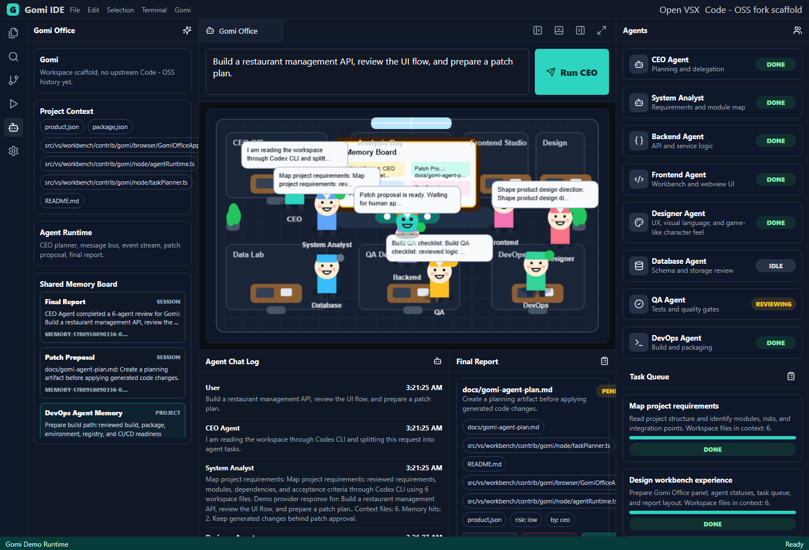
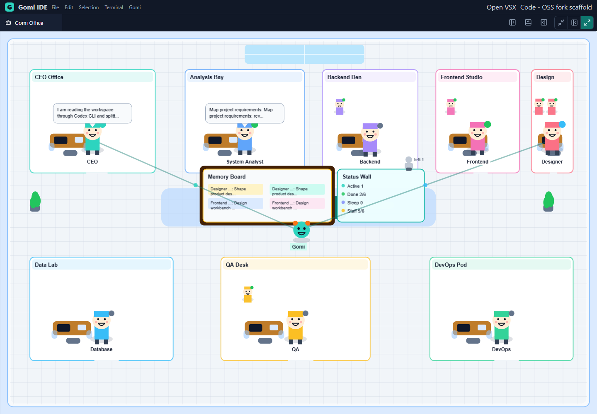

# Gomi IDE

**Gomi Office IDE: Multi-Agent Development Environment**

Gomi IDE is a product foundation for a standalone developer IDE built from a **Code - OSS fork**. It combines a familiar editor workbench with a visual multi-agent office where software tasks are planned, delegated, reviewed, and approved before code changes are applied.

The product direction is not "a VS Code extension". The intended commercial product is an independent IDE distribution:

```text
Fork Code - OSS
-> Rebrand as Gomi IDE
-> Customize the workbench
-> Add the Gomi Multi-Agent Office
-> Add the AI Agent Runtime
-> Package and distribute as a standalone IDE installer
```





## Product Vision

Modern AI coding tools often compress all collaboration into a single chat surface. Gomi takes a different approach: it turns project work into a visible, structured office.

The user enters a development request. A CEO Agent analyzes the workspace, creates a plan, delegates work to specialist agents, stores useful project knowledge in shared memory, and produces a patch proposal that the user must review before applying.

The goal is to make AI-assisted development more understandable, auditable, and suitable for professional engineering teams.

## Commercial Positioning

Gomi IDE is designed to become a commercial-grade AI development environment with:

- A standalone branded IDE experience based on Code - OSS.
- A visual multi-agent workflow instead of a generic chat-only assistant.
- Project-aware memory and retrieval for long-running work.
- Human approval gates before code modification.
- A path to cloud LLM providers, local models, or enterprise-managed model routing.
- Open VSX or a dedicated extension marketplace strategy.
- Windows desktop build and release automation for Code - OSS packaging.
- Clear separation between product branding, editor core, AI runtime, and visual office UI.

This repository is the current product foundation and technical prototype. It is not yet a fully packaged Code - OSS distribution.

## Key Capabilities

- **Gomi-branded product metadata** through `product.json`.
- **Generated desktop branding assets** for Code - OSS app icons, Windows tile icons, installer bitmaps, Linux icon, and macOS icon bundle.
- **Workbench-compatible module structure** under `src/vs/workbench/contrib/gomi`.
- **Code - OSS integration manifest** for copying branding, resources, and the Gomi workbench module into a real fork before packaging.
- **Native Code - OSS workbench contribution template** that registers the Gomi Office Activity Bar container and view through workbench registries.
- **Generated Gomi Office webview bundle pipeline** for mounting the React/Phaser office inside the native Code - OSS view pane.
- **Gomi Office panel UI** built with React.
- **Standard, Expanded, and Full Office layout modes** so side panels can collapse and the visual office can take over the workspace.
- **Responsive agent/settings drawer** so office staffing controls remain reachable on compact workbench widths.
- **Cute real-office 2D simulation** built with Phaser, including rooms, desks, doors, shared boards, staff avatars, and route lines.
- **Animated game-style agents and staff** with visible status, sleep state, offboarded markers, and chat bubbles.
- **Directed agent conversations** where important broadcasts include a recipient, the speaking avatar runs toward that agent, and the shared bubble appears at the meeting point.
- **Responsive office layout model** with dedicated rooms, a shared memory board, a status wall, and route lines showing Gomi moving between active agents.
- **Shared memory board** fed by real runtime memory updates for project context.
- **CEO Agent planning flow** with specialist agent delegation.
- **Office organization settings** for assigning CLI agent routes to the CEO and department heads.
- **Persisted Office Settings** through VS Code webview state with local storage fallback for the standalone demo.
- **Department head sleep mode** to pause a leader without removing the role from the organization.
- **Employee lifecycle controls** for hiring additional department staff, offboarding non-lead employees, restoring employees, and running a staffing demo scenario.
- **Workbench agent provider router** for demo, CLI, OpenAI-compatible HTTP, and Ollama-compatible local model routes.
- **Live provider execution policy** with workspace trust state, demo-only/trusted-workspace/allow-all modes, CLI/HTTP transport toggles, and patch-approval enforcement.
- **Configurable agent communication policy** that keeps routine updates in memory and only broadcasts findings above the selected importance threshold.
- **Novelty-aware agent communication** that checks recalled shared memory before showing another chat bubble for repeated routine findings.
- **Hybrid project memory** using lexical search plus vector-style retrieval.
- **Configurable embedding provider layer** with deterministic local hashing, OpenAI-compatible HTTP embeddings, and Ollama local embedding routes.
- **Office Settings controls for vector memory embeddings** so users can keep retrieval offline or enable approved cloud/local embedding routes.
- **Persistent workspace memory storage** for lexical and vector records under `.gomi-ide/memory`.
- **Memory privacy and retention controls** for shared-memory enablement, workspace indexing, strict privacy mode, secret redaction, retention days, max project memory items, and patch approval policy.
- **Project context indexing** for file tree, manifests, open editor snippets, selected code, terminal output, diagnostics, SCM/git diff previews, and optional error logs.
- **Patch review workflow** with webview diff preview, native Code - OSS diff preview hook, approve/reject controls, and apply gating.
- **Safe node-side patch application core** for approved unified diffs inside the workspace root.
- **Runtime events** for session lifecycle, messages, task updates, agent results, memory updates, patch proposals, and final reports.
- **Workbench bridge controller** for routing webview messages to the runtime and approved patch applier.
- **Webview bridge client** that can send run requests, office settings, and patch-apply messages from the React office to the native workbench host.
- **Native webview host bridge and controller** for receiving `gomi.run` messages from the mounted office webview and streaming runtime events back into the UI.
- **Code - OSS workspace services adapter** for reading workspace folders, open editors, selected code, diagnostics, important text snippets, and applying approved unified diffs through workbench file/text services.
- **Node-side CLI agent router** for executing selected CEO and department-head CLI providers when enabled in the workbench runtime.
- **GitHub Actions release workflow** for verification, artifacts, and optional Windows Code - OSS packaging.
- **Open VSX Registry metadata** instead of Microsoft Visual Studio Marketplace metadata.

## Multi-Agent Office

Gomi models product development as a virtual office:

- **CEO Agent**: plans work, delegates tasks, tracks progress, and synthesizes the final report.
- **System Analyst Agent**: maps requirements, modules, risks, and acceptance criteria.
- **Backend Agent**: reviews APIs, controllers, services, models, and backend logic.
- **Frontend Agent**: reviews workbench UI, webview state, panels, and user flows.
- **Designer Agent**: defines UX direction, visual language, office atmosphere, avatar style, and interaction polish.
- **Database Agent**: reviews schema, migrations, models, and persistence.
- **QA Agent**: reviews logic risks, edge cases, test strategy, and regression gates.
- **DevOps Agent**: reviews build, packaging, environment, extension registry, and deployment path.
- **Gomi Guide**: the visual companion inside the office simulation.

## Architecture

```text
Gomi IDE
|-- Code Editor Core
|   |-- File Explorer
|   |-- Text Editor
|   |-- Terminal
|   |-- Debug
|   `-- Git
|
|-- Gomi Multi-Agent Office
|   |-- CEO Agent
|   |-- System Analyst Agent
|   |-- Backend Agent
|   |-- Frontend Agent
|   |-- Designer Agent
|   |-- Database Agent
|   |-- QA Agent
|   |-- DevOps Agent
|   `-- Gomi Guide
|
|-- Agent Communication Layer
|   |-- Task Planner
|   |-- Message Bus
|   |-- Event System
|   |-- Communication Policy
|   `-- Result Aggregator
|
|-- Visual Office Simulation
|   |-- 2D Office Map
|   |-- Agent Avatars
|   |-- Animation
|   |-- Chat Bubbles
|   |-- Memory Board
|   |-- Status Wall
|   |-- Gomi Route Lines
|   `-- Task Status Panel
|
`-- AI Runtime
    |-- Agent Provider Contract
    |-- CLI Agent Routing
    |-- Cloud LLM Adapter Path
    |-- Local Model Adapter Path
    |-- Cloud/Local Embedding Provider
    |-- Hybrid Project Memory
    |-- Vector Retrieval
    |-- Project Context Indexer
    `-- Patch Proposal Flow
```

## Shared Project Memory

Gomi agents share a project memory layer so they do not need to repeat every observation in chat.

The current implementation uses hybrid retrieval:

- **Lexical memory search** for exact file paths, symbols, package names, commands, and configuration keys.
- **Vector-style retrieval** for semantic search across project facts and agent findings.
- **Scoped memory** by workspace/thread to avoid leaking knowledge between projects.
- **Agent result memory** so specialist agents can build on prior findings.
- **Project context indexing** so workspace metadata and content snippets can be retrieved by task.
- **Workspace persistence** through file-backed lexical and vector memory stores when running from the workbench controller.
- **Communication policy** so low-importance findings are stored silently while high-importance findings become visible messages and chat bubbles. The runtime also checks recalled project memory so repeated routine findings stay quiet unless a new risk, blocker, or low-confidence concern appears.
- **Privacy guard** that filters sensitive file paths, keeps safe templates such as `.env.example`, redacts secret-looking values, and removes terminal/error-log snippets from indexing in strict mode.
- **Retention policy** that prunes old lexical and vector memory records and caps the number of stored project memory items per workspace scope.
- **Memory board events** so the visual office can display the actual request, workspace facts, retrieved project context, and agent findings stored in shared memory.

By default, vector retrieval uses a deterministic local hashing embedding provider. It does not require an API key, works offline, and keeps tests predictable.

For production-style retrieval, the workbench controller can switch to HTTP embeddings while keeping the same vector memory contract:

- **OpenAI-compatible embeddings** through `GOMI_EMBEDDINGS_ENDPOINT`, `GOMI_EMBEDDINGS_MODEL`, and optional `GOMI_EMBEDDINGS_API_KEY`.
- **Ollama local embeddings** through `GOMI_EMBEDDINGS_PROVIDER=ollama-embeddings` or `GOMI_EMBEDDINGS_PROVIDER=ollama-embed`, plus `GOMI_LOCAL_EMBEDDINGS_ENDPOINT` and `GOMI_LOCAL_EMBEDDINGS_MODEL`.
- **Explicit execution control** through `GOMI_EMBEDDINGS_ENABLED=true|false` or host-side `GomiWorkbenchController` options.
- **Office-level provider selection** for Local Hashing, OpenAI-compatible embeddings, Ollama `/api/embeddings`, and Ollama `/api/embed`.
- **Safe fallback behavior** that returns to local hashing when HTTP embeddings are disabled, unavailable, misconfigured, or return an invalid vector.

The workbench controller persists lexical and vector memory records in workspace storage so future sessions can reuse project context. In a production build, this file-backed storage can be replaced by SQLite, a local vector database, or an enterprise-managed vector service without changing the runtime contract.

## Agent Provider Routing

Gomi separates office organization from agent execution.

The Office Settings view lets the user assign providers to the CEO and each department head. The node-side workbench runtime includes a provider router that can dispatch work to deterministic demo mode, CLI agents, OpenAI-compatible HTTP chat APIs, or Ollama-compatible local chat APIs.

CLI and HTTP execution are disabled by default in the prototype for safety and deterministic tests. A real Code - OSS workbench integration can enable them through `GomiWorkbenchController` once provider commands, endpoint/model/API-key environment variables, workspace trust, approval policy, and enterprise controls are configured. When host execution is disabled, the same route metadata still flows through the runtime and the demo provider remains the fallback.

Live provider execution is also gated by Office Settings:

- `demo-only` keeps every non-demo route on deterministic fallback behavior.
- `trusted-workspaces` allows live providers only after the workspace is marked trusted.
- `allow-all` is available for controlled development and enterprise-managed environments.
- CLI and HTTP transports can be enabled independently.
- Patch approval can be required before any live provider route is allowed to run.

Supported provider routes:

- `codex-cli`, `claude-code`, `gemini-cli`, `aider-cli`, `cursor-style-agent`, and `local-llm` through the CLI router.
- `openai-compatible-api` through `GOMI_CLOUD_LLM_ENDPOINT`, `GOMI_CLOUD_LLM_MODEL`, and optional `GOMI_CLOUD_LLM_API_KEY`.
- `ollama-local-model` through `GOMI_LOCAL_LLM_ENDPOINT` and `GOMI_LOCAL_LLM_MODEL`.
- `demo-runtime` for offline, deterministic product previews and tests.

## Patch Review And Safety

Gomi is designed around review-first code modification.

Current patch flow:

```text
Agent results
-> CEO synthesis
-> Patch proposal
-> Webview diff preview
-> Native Code - OSS diff preview when the workbench host is available
-> User approves or rejects
-> Apply remains disabled until approval and required preview
-> Approved unified diff can be applied inside the workspace root
```

The node-side patch applier parses unified diffs, verifies context lines, blocks paths that escape the workspace, supports dry-run mode, and refuses unapproved patches by default. The native host bridge can require a successful patch preview before applying a patch, and it verifies that the diff being applied matches the diff that was previewed. This keeps generated changes auditable and prevents agents from silently modifying source code.

## Code - OSS Integration Path

The intended product path is:

1. Fork Code - OSS.
2. Bootstrap or reuse a Code - OSS checkout with `scripts/bootstrap-gomi-code-oss-fork.ps1`.
3. Apply `build/gomi-code-oss.integration.json` with `scripts/apply-gomi-code-oss-integration.ps1`.
4. Replace all product metadata with Gomi branding.
5. Replace app icons, splash/about assets, and distribution names.
6. Configure Open VSX or a Gomi-owned extension marketplace.
7. Register `Gomi Office` in the Activity Bar.
8. Load the Gomi Office webview inside the workbench.
9. Connect `gomiBridge.ts` and `gomiWorkbenchController.ts` to the workbench/webview message boundary.
10. Run the AI runtime from the workbench/node side.
11. Feed workspace files, open editors, selected code, terminal output, git diff, diagnostics, and logs into the project context indexer.
12. Show generated changes through a diff-first approval flow.
13. Package Gomi IDE for Windows, macOS, and Linux.

## Windows Desktop Build

Gomi IDE should be released as a desktop artifact from a Code - OSS fork, not as an `npm run dev` app.

This repository includes:

- `.github/workflows/build-release.yml` for verification, versioned artifact upload, optional Code - OSS Windows packaging, release notes, and GitHub Releases.
- `build/gomi-code-oss.integration.json` for declaring the Gomi files, product metadata overlay, resources, and workbench import to apply to a Code - OSS checkout.
- `build/code-oss-templates/gomiContribution.ts` for overlaying the native Code - OSS view/container registration during fork integration.
- `npm run build:webview` for generating the bundled Gomi Office webview assets copied into the Code - OSS workbench module.
- `npm run generate:brand-assets` for generating the Gomi desktop icon, Windows installer bitmaps, Linux icon, and macOS icon bundle copied into the Code - OSS packaging resource paths.
- `scripts/bootstrap-gomi-code-oss-fork.ps1` for cloning or reusing a Code - OSS checkout, building Gomi assets, and applying the Gomi workbench integration.
- `scripts/apply-gomi-code-oss-integration.ps1` for applying or validating Gomi branding/module integration against a Code - OSS fork.
- `scripts/build-gomi-code-oss-windows.ps1` for local or CI packaging against a real Code - OSS fork.
- `docs/windows-release.md` with the Windows build and release workflow.

The prototype `npm` commands remain useful for developing and testing the Gomi Office module. The product distribution path is the Code - OSS packaging path: the packaging script merges Gomi product metadata over the fork's existing `product.json`, applies Gomi workbench files, then invokes the upstream gulp packaging tasks to produce a packaged Windows build and, when the fork exposes a compatible setup task, a setup `.exe`.

GitHub Actions release behavior:

- Pushes to `master` verify the scaffold, run release-readiness checks, and upload the Gomi Office prototype/webview bundle with a SHA-256 checksum.
- Tags matching `v*` run the Windows Code - OSS packaging job and publish a prerelease.
- Manual workflow runs can publish a release only when the Windows desktop packaging job is enabled and succeeds.
- Produced Windows artifacts are collected from Code - OSS `.build` output as `.exe`, `.msi`, or `.zip` files, with a generated `ARTIFACTS.md` manifest and SHA-256 checksums.

The desktop packaging script builds the React/Phaser office bundle into `build/gomi-office-webview`, copies it to `src/vs/workbench/contrib/gomi/browser/media/office` inside the Code - OSS fork, and the native contribution template mounts that bundle through an internal workbench webview.

The webview bundle includes an optional workbench bridge client. It only activates when the native host explicitly enables `__GOMI_ENABLE_WORKBENCH_BRIDGE__`, then sends `gomi.run` messages with the current office settings and sends approved `gomi.applyPatch` messages back to the host. The native template creates a host bridge/controller, reads workspace context through Code - OSS workspace/code-editor/editor/marker/file/text-file services, streams runtime events back into the office UI, and applies approved unified diffs through workbench services.

Local dry-run validation:

```powershell
powershell -ExecutionPolicy Bypass -File .\scripts\bootstrap-gomi-code-oss-fork.ps1 `
  -CodeOssRoot D:\path\to\code-oss-fork `
  -Repository https://github.com/your-org/gomi-code-oss.git `
  -Ref main `
  -DryRun
```

Local integration validation against an existing checkout:

```powershell
powershell -ExecutionPolicy Bypass -File .\scripts\build-gomi-code-oss-windows.ps1 `
  -CodeOssRoot D:\path\to\code-oss-fork `
  -Platform win32-x64 `
  -Minified `
  -BuildSetup `
  -DryRun
```

## Repository Layout

```text
src/vs/workbench/contrib/gomi/
|-- browser/
|   |-- codeOssWorkspaceServices.ts
|   |-- GomiOfficeApp.tsx
|   |-- PhaserOffice.tsx
|   |-- gomiPatchApproval.ts
|   |-- gomiContribution.ts
|   |-- gomiOfficeView.ts
|   |-- gomiAgentPanel.ts
|   |-- gomiTaskView.ts
|   `-- gomiChatView.ts
|
|-- common/
|   |-- gomiUnifiedDiff.ts
|   |-- gomiTypes.ts
|   |-- gomiEvents.ts
|   `-- gomiConstants.ts
|
|-- electron-sandbox/
|   `-- gomiBridge.ts
|
`-- node/
    |-- agentRuntime.ts
    |-- gomiWorkbenchController.ts
    |-- agentProvider.ts
    |-- cliAgentProvider.ts
    |-- taskPlanner.ts
    |-- messageBus.ts
    |-- memoryStore.ts
    |-- vectorMemoryStore.ts
    |-- embeddingProvider.ts
    |-- sharedProjectMemory.ts
    |-- projectContextIndexer.ts
    |-- persistentProjectMemory.ts
    |-- communicationPolicy.ts
    |-- resultAggregator.ts
    |-- workspaceReader.ts
    |-- nodeWorkspaceReader.ts
    |-- workspacePatchApplier.ts
    `-- patchApplier.ts
```

Supporting release files:

```text
build/
|-- code-oss-templates/
|   `-- gomiContribution.ts
|-- gomi-office-webview/        # generated by npm run build:webview
`-- gomi-code-oss.integration.json

scripts/
|-- apply-gomi-code-oss-integration.ps1
|-- bootstrap-gomi-code-oss-fork.ps1
|-- generate-gomi-brand-assets.mjs
`-- build-gomi-code-oss-windows.ps1

resources/gomi-branding/
|-- win32/
|   |-- gomi.ico
|   |-- gomi_70x70.png
|   |-- gomi_150x150.png
|   `-- inno-*.bmp
|-- linux/
|   `-- gomi.png
`-- darwin/
    `-- gomi.icns

.github/workflows/
`-- build-release.yml
```

## Current Implementation Status

Implemented in this repository:

- Gomi product metadata with merge-safe Code - OSS overlay integration.
- Product metadata stripping for upstream built-in extension/chat/onboarding defaults that do not belong in a Gomi-branded commercial fork.
- Generated Gomi desktop branding assets for Windows, Linux, and macOS Code - OSS packaging resource paths.
- Workbench-compatible Gomi module skeleton.
- React workbench shell.
- Phaser 2D office simulation with a brighter real-office scene, room accents, desks, doors, shared boards, and staff markers.
- Responsive office layout model with deterministic room, seat, memory-board, status-wall, and Gomi-hub coordinates.
- Animated office avatars, department staff avatars, offboarded employee markers, and chat bubbles.
- Memory board and task status UI backed by runtime `memory_update` events.
- Collapsible side/bottom panels plus Standard, Expanded, and Full Office layout modes.
- Responsive agent/settings drawer for compact workbench widths.
- CEO Agent planning simulation.
- Specialist agent runtime flow with a configurable fair queue for concurrent department agent execution.
- Designer Agent role for UX, visual language, office atmosphere, and avatar direction.
- Office settings for CEO and department-head CLI routing.
- Department-head sleep mode plus employee hire, offboard, restore, and staffing-demo controls.
- Runtime event stream including shared-memory board updates.
- Workbench bridge controller for `gomi.run`, runtime event forwarding, native patch preview, and approved patch apply messages.
- Native Code - OSS registration template for the Gomi Office Activity Bar container and webview-backed view pane.
- Generated webview asset path for mounting the React/Phaser office bundle inside the native pane.
- Optional webview bridge client with deterministic demo fallback when no native host is attached.
- Native webview host bridge/controller path for run-message handling and runtime event streaming.
- Code - OSS workspace services adapter for native workspace folders, open editors, selected code, diagnostics, terminal output, SCM/git diff previews, optional error logs, text snippets, native diff preview, and approved patch application.
- Agent provider contract with a demo provider.
- Node-side CLI provider router with command execution, JSON/plain-text output mapping, and demo fallback.
- Workbench provider router for CLI, OpenAI-compatible HTTP, Ollama-compatible local HTTP, and demo routes.
- HTTP agent provider adapter with endpoint/model/API-key environment routing and JSON/plain-text result mapping.
- Workspace trust and live execution policy for CLI/HTTP providers.
- Hybrid project memory with lexical and vector-style retrieval.
- HTTP embedding provider adapter for OpenAI-compatible and Ollama local embedding routes, with deterministic hashing fallback.
- Office Settings vector embedding provider selection and HTTP embedding execution toggle.
- Persisted Office Settings for agent provider assignments, sleep/fire state, execution policy, and memory controls.
- File-backed persistent project memory for workbench sessions.
- Memory privacy guard with secret redaction, strict mode, shared-memory toggles, retention days, and max project memory controls.
- Project context chunking and indexing.
- Configurable novelty-aware communication policy for selective agent broadcast.
- Node workspace reader for real project metadata and content snippets.
- Patch proposal, webview diff preview, native diff preview hook, approve/reject, and apply gating.
- Safe unified-diff patch application core for approved workspace edits.
- Code - OSS integration manifest and validation/apply script.
- Code - OSS fork bootstrap script for cloning/reusing a checkout and applying the Gomi overlay.
- GitHub Actions build/release workflow and Windows Code - OSS packaging script.
- Tests for runtime memory updates, CLI routing, planner, message bus, patch approval, patch application, Code - OSS workspace service adaptation, workspace reader, project context indexing, shared memory, privacy guard, persistent memory pruning, and vector memory.

Not yet implemented:

- Full upstream Code - OSS source integration.
- Validating the React/Phaser webview mount and native diff preview inside a real Code - OSS checkout.
- Durable terminal scrollback capture beyond the selected/current exposed terminal text.
- Native output-channel/log-service integration beyond the current optional error-log provider hook.
- Production provider secrets UI and enterprise model governance.
- Native Code - OSS workspace-trust service binding beyond the current settings-level trust state.
- Persistent database-backed memory and external vector database indexing.
- Signed desktop packaging assets and production release signing.
- Enterprise settings, licensing, update channel, and telemetry policy.

## Getting Started

Install dependencies:

```bash
npm install
```

Run the local workbench demo:

```bash
npm run dev
```

Run tests:

```bash
npm test
```

Run TypeScript checks:

```bash
npm run typecheck
```

Generate desktop branding assets:

```bash
npm run generate:brand-assets
```

Run release-readiness checks:

```bash
npm run verify:release
```

Build:

```bash
npm run build
```

## Verification

The current verification suite covers:

- Runtime session flow.
- Message bus publish/subscribe.
- Task planner output.
- Patch approval state transitions.
- Safe patch application and workspace path containment.
- Code - OSS workspace service adaptation, selected code capture, diagnostics capture, terminal output capture, SCM/git diff previews, optional error-log capture, native diff preview input creation, and approved native patch application path.
- Workbench bridge controller message routing, preview-before-apply guard, and stale-diff rejection.
- Persistent lexical and vector memory storage.
- Node workspace context reading.
- Project context indexing.
- Shared project memory.
- Vector-style retrieval.
- Release readiness for Gomi branding, Open VSX metadata, Code - OSS packaging workflow, and executable-first documentation.

Current known build note: Phaser increases the production JavaScript chunk size. This is expected for the visual office prototype and should be optimized with code splitting before a packaged release.

## Branding And Marketplace

The standalone product should not ship with Visual Studio Code or Microsoft branding.

Current product metadata:

```json
{
  "nameShort": "Gomi",
  "nameLong": "Gomi IDE",
  "applicationName": "gomi-ide",
  "dataFolderName": ".gomi-ide",
  "sharedDataFolderName": ".gomi-ide-shared",
  "serverApplicationName": "gomi-server",
  "serverDataFolderName": ".gomi-server",
  "tunnelApplicationName": "gomi-tunnel",
  "win32MutexName": "gomiide",
  "win32AppUserModelId": "Gomi.IDE",
  "win32DirName": "Gomi IDE",
  "darwinBundleIdentifier": "com.gomi.ide",
  "linuxIconName": "gomi-ide",
  "urlProtocol": "gomi",
  "licenseName": "MIT"
}
```

The current extension gallery metadata points to Open VSX Registry. A commercial distribution may keep Open VSX, add a Gomi marketplace, or support both depending on licensing and product strategy.

## Commercialization Roadmap

Recommended next milestones:

1. Import the module into a real Code - OSS fork.
2. Complete Gomi branding assets across Windows, macOS, and Linux.
3. Harden provider secrets UI, model governance, and native workspace-trust binding for OpenAI-compatible APIs and local model runtimes.
4. Add persistent memory using SQLite and optional vector database support.
5. Deepen native workspace context with durable terminal scrollback and workbench log/output-channel readers.
6. Validate and polish the native diff preview inside a real Code - OSS fork.
7. Harden enterprise settings for model provider governance, native workspace trust, privacy policy, memory retention, and approval policy.
8. Add packaging, signing, update channel, and release automation.
9. Define licensing, commercial terms, and enterprise deployment policy.

## Trust, Privacy, And Control

Commercial Gomi builds should preserve these principles:

- Users can review generated changes before apply.
- Workspace memory is scoped and controllable.
- Provider routing is explicit.
- Local model mode should be available for private projects.
- Telemetry, if added, must be documented and configurable.
- Secrets such as `.env` values must never be indexed or committed by default.

## Technology Stack

- Base product direction: Code - OSS fork
- Language: TypeScript
- Final runtime target: Electron + Node.js
- Demo UI: React + Vite
- Office simulation: Phaser
- Icons: Lucide React
- Testing: Vitest
- Extension registry direction: Open VSX Registry

## License And Distribution Notes

This repository is a Gomi IDE product foundation. Before commercial distribution, review Code - OSS license obligations, third-party dependency licenses, marketplace terms, branding rules, and generated asset rights.

## Electron desktop shell

`npm run build && npm run electron:start` loads the production `dist/index.html` bundle.

For live Office UI iteration, start Vite then open Electron in dev mode:

```bash
npm run dev
# other terminal:
npm run electron:dev
```

`GOMI_ELECTRON_DEV=1` makes Electron load the Vite server (default `http://127.0.0.1:5173`). Optional overrides: `GOMI_VITE_DEV_URL`, `GOMI_VITE_PORT`. Packaged builds ignore these flags and always load the built index.
